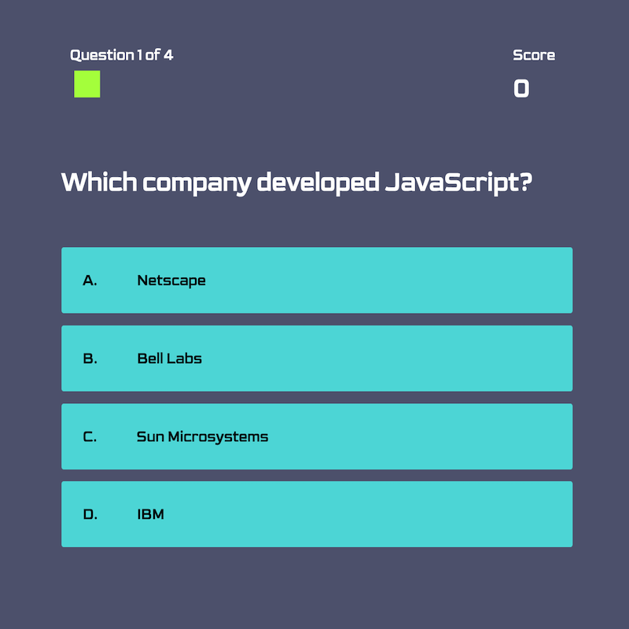
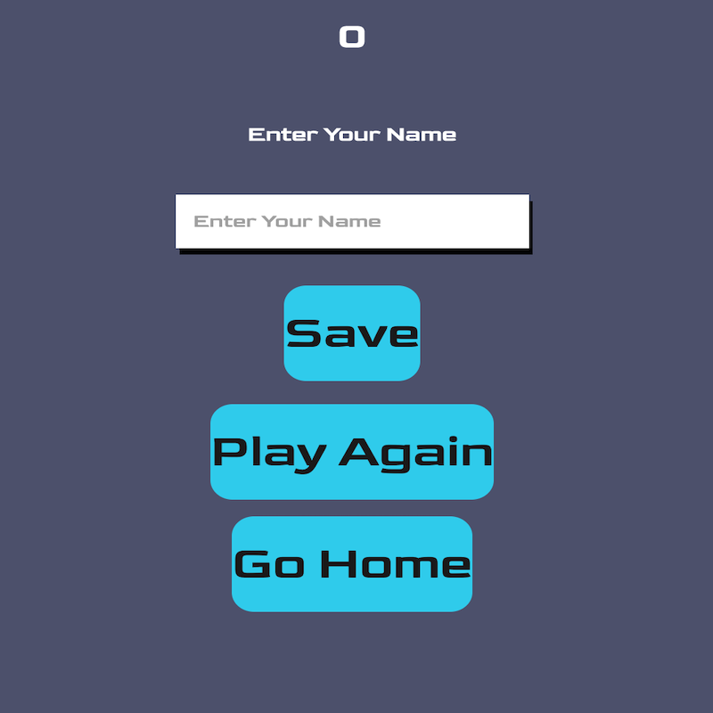

# 04 Web APIs: Code Quiz
## Description

The following webpage consists of multiple choice questions testing your knowledge on JavaScript fundamentals!  Avoid the glaring red notification if you get an answer wrong and complete the progress bar.  Can you beat the high score?  That's right, save your high score and show all your friends that you are number one.  If you restart the game the questions will randomize order to truly test your knowledge and not just your memorization.

## Developer
The multiple choice quiz runs on HTML, CSS, and JavaScript to provide the user multiple choice questions on JavaScript trivia.  JavaScript alerts the user if they got a question wrong or right, and as they move on to the next question, the progress bar increases.  The homepage lets the user to check on highscores or jump right into the game.  At the beginning of each game, the questions will randomize in order to give the user a more challenging experience.  

The questions are built in an array and correct answers will increase the score by 100.  There are 4 questions overall, each with 4 multiple choices.  At the end of the game, the user inputs their name that saves to local storage.  Media queries were utilized within the game to provide a responsive layout.  Test your knowledge here: [JavaScript Quiz!][demo]

## Mock-Up
The following screenshots show the homepage, game, and highscore screens:

 

[demo]: https://rpc08002.github.io/Code-Quiz/

## Features:
* Three HTML Pages
  * Index.html
    * Contains homepage with links to game or high score list.
    *